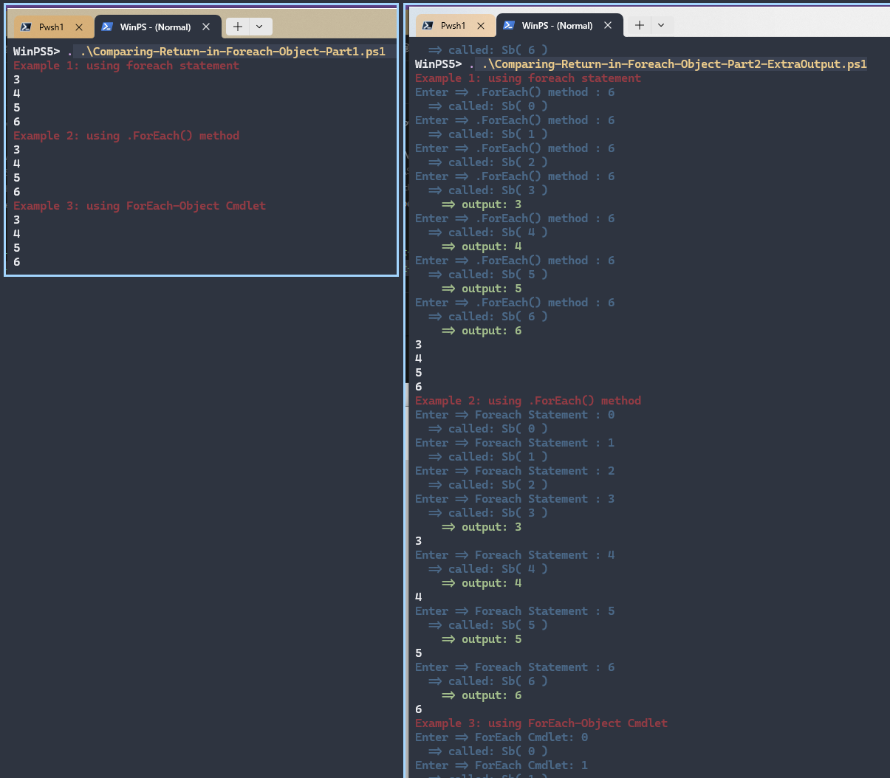

## Comparing Foreach Method, Statement, and Cmdlet

- [Part 1: Comparing Return in Foreach Method, Statement, and Cmdlet](./Comparing-Return-in-Foreach-Object-Part1.ps1)
- [Part 2: Comparing Return with verbose output](./Comparing-Return-in-Foreach-Object-Part2-ExtraOutput.ps1)

## See More: Docs

- [using ForEach Method](https://learn.microsoft.com/en-us/powershell/module/microsoft.powershell.core/about/about_arrays?view=powershell-7.6#foreach)

- [using ForEach Statement](https://learn.microsoft.com/en-us/powershell/module/microsoft.powershell.core/about/about_foreach?view=powershell-7.6)

- [using Foreach-Object Cmdlet](https://learn.microsoft.com/en-us/powershell/module/microsoft.powershell.core/foreach-object?view=powershell-7.6)

- [about: Language Keywords](https://learn.microsoft.com/en-us/powershell/module/microsoft.powershell.core/about/about_language_keywords?view=powershell-7.6)
  - [`break` statement](https://learn.microsoft.com/en-us/powershell/module/microsoft.powershell.core/about/about_break?view=powershell-7.6)
  - [`foreach` statement](https://learn.microsoft.com/en-us/powershell/module/microsoft.powershell.core/about/about_foreach?view=powershell-7.6)

> [!IMPORTANT]
> [Do not use `break / continue` outside of a loop, switch, or trap](https://learn.microsoft.com/en-us/powershell/module/microsoft.powershell.core/about/about_break?view=powershell-7.6#do-not-use-break-outside-of-a-loop-switch-or-trap)

> When break is used outside of a construct that directly supports it (loops, switch, trap), PowerShell looks up the call stack for an enclosing construct. If it can't find an enclosing construct, the current runspace is quietly terminated.

> This means that functions and scripts that inadvertently use a break outside of an enclosing construct that supports it can inadvertently terminate their callers.

> Using break inside a pipeline break, such as a ForEach-Object script block, not only exits the pipeline, it potentially terminates the entire runspace.