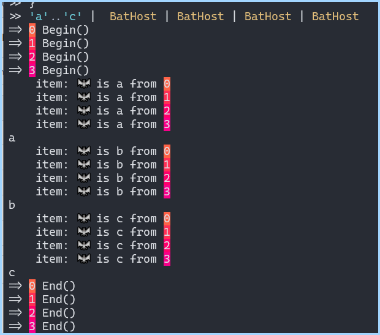

# Examples using the Pipeline

## Difference when Piping vs Parameters

- [Passing-Array-ByValue-Vs-ByPipeline.ps1](./Passing-Array-ByValue-Vs-ByPipeline.ps1)

## Visualize Begin/Process/End blocks

- [Visualize-Command-Pipeline.ps1](./Visualize-Command-Pipeline.ps1)

