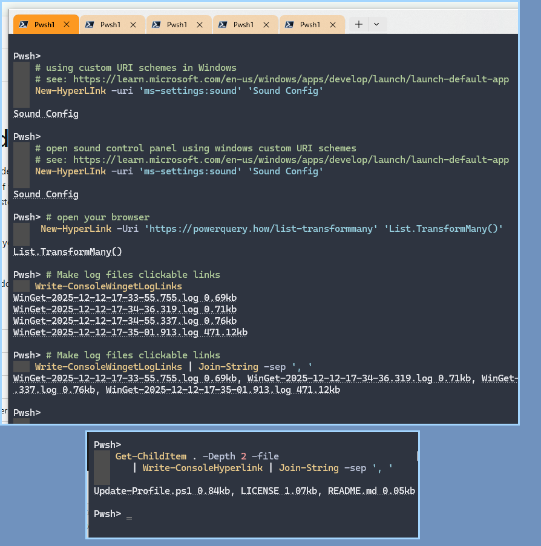

Console Hyperlinks and code that uses native commands/applications 

## Applications / Native Commands 

- [fzf](./fzf)
- [gh](./gh)
- [git](./git)

## Hyperlinks

Do you wish you could write a `<a href="fullpath">short name</a>` to the console? 

- `Pansies\New-HyperLink` makes that easy
- The screenshot [`Write-ConsoleHyperLink` and `Write-ConsoleWingetLogLinks` are from here](./Write-ConsoleHyperLink.ps1)

## See more: Related Locations

These have some overlap

- `TinyBits/cli/readme.md`
- `TinyBits/pwsh/cli/readme.md` ( here )
- `TinyBits/pwsh/git/readme.md` 

