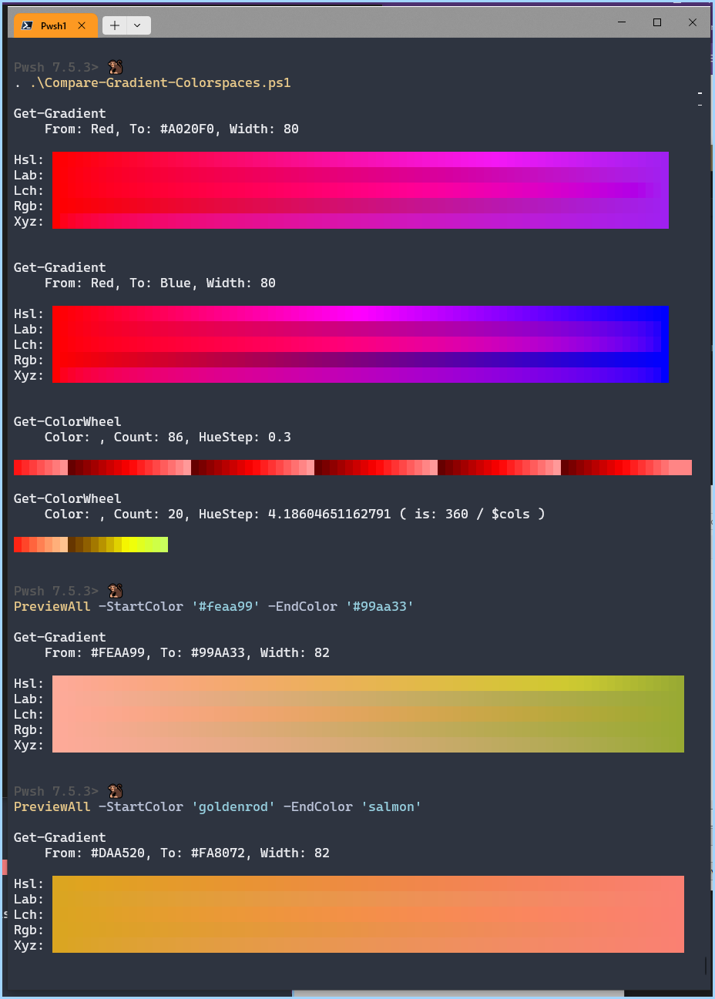
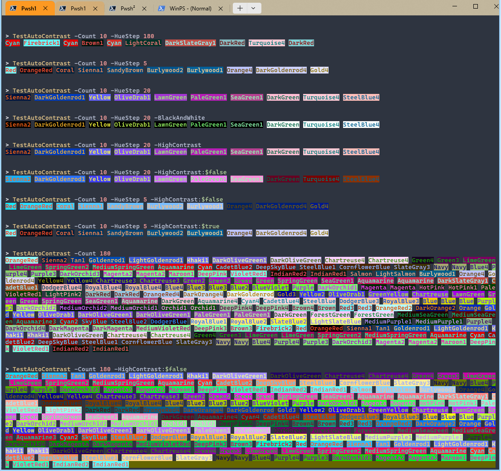

[Go Back ⮥](./..) or [⮥ ⮥](./../../readme.md)

Console colors using the `pansies` module

- [Compare-Gradient-Colorspaces.ps1](./Compare-Gradient-Colorspaces.ps1)
- [ArgumentCompleter-For-RgbColor.ps1](./ArgumentCompleter-For-RgbColor.ps1) - Add **Pansies**'s `[RgbColor]` to your functions
- [Automatic BackgroundColors WithContrast.ps1](./AutoBackgroundColor-WithContrast.ps1) - Calculate background colors with contrast

**Examples**

From [Compare-Gradient-Colorspaces.ps1](./Compare-Gradient-Colorspaces.ps1)

From [AutoBackgroundColor-WithContrast.ps1](./AutoBackgroundColor-WithContrast.ps1)