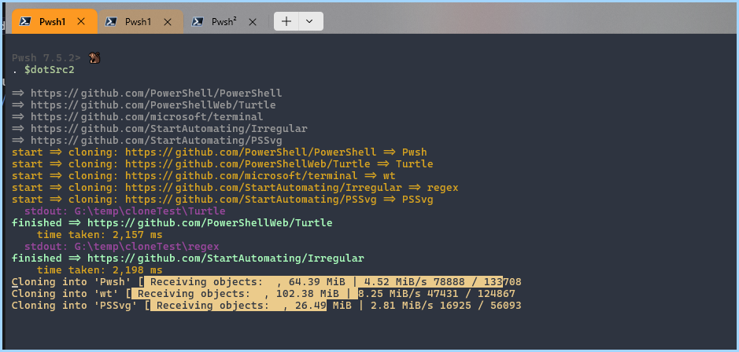
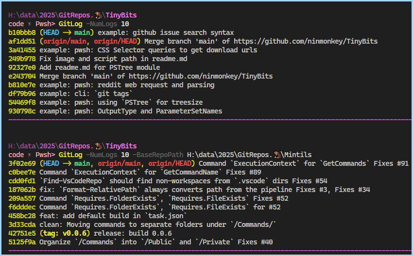

## About

- [`git clone` using ThreadJobs and Ugit](./GitClone-UsingThreadJobs-with-Ugit.ps1)

- [BuildingDynamicNativeArgs for `git log`](./GitLog-BuildingDynamicNativeArgs.ps1)

## See more: Related Locations

These have some overlap

- `TinyBits/cli/readme.md`
- `TinyBits/pwsh/cli/readme.md`
- `TinyBits/pwsh/git/readme.md` ( here )
