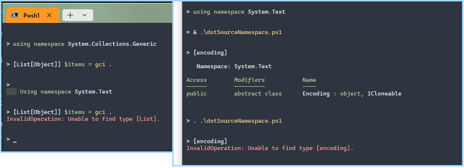

## Using Namespace statements



<!--
Until something else runs a using namespace, then the previous aliases are dropped
It depends if you run it as as a script / dotsourcing / or as a module. 

So 
using . $src : replaces users state  👎
using `REPL: replaces users state  👎
using call: & $src : preserves user state 👍
using inside a module: preserves user state 👍

The screenshot shows the first 3 options 

---------------------
A lot of people save a their profile script as a module. It's almost the same for you to write
But you can do things without it polluting the user's scope 
And it doesn't break the user's global state
-->

### Testing Interactively 

```ps1
# [1] 
using namespace System.Collections.Generic

# hit enter, then run
[List[object]] $Items = gci . 
    # Type found, it works. 
```
```ps1
using namespace System.Text
# hit enter, then run

[List[object]] $Items = gci . 
    # Type not found, error
```

### Using a Script

file: `usingNamespace.ps1`
```ps1
using namespace System.Collections.Generic
[List[object]] $nums = 0..4
```

```ps1
using namespace System.Text
# hit enter, then run

& .\usingNamespace.ps1

[Encoding] # works, type found

. .\usingNamespace.ps1

[Encoding] # Error, using statement was clobbered
```

### Using a module Import

Create the file then run
```ps1
Import-Module .\moduleNamespace.psm1 -Force -PassThru -Verbose
```

file: `usingModule.psm1`
```ps1
using namespace System.Text
    
function Dotils.Get-Stuff {
    param( [string] $Text )
    [pscustomobject]@{
        Text   = $Text
        AsUtf8 = [Encoding]::UTF8.GetBytes( $Text )
    }
}

'Try: "$SharedStuff" and "Dotils.Get-Stuff"' | Write-Verbose -verbose
Export-ModuleMember -Variable @( 'SharedStuff' ) -Function @( 'dotils.*' )
```

Now show the user's scope isn't clobbered even though the module's namespace is set
```ps1
using namespace System.Collections.Generic

# [1] works, type found
[List[Object]] $stuff = 0..3

Import-Module .\moduleNamespace.psm1 -Force -PassThru -Verbose

# [2] 
[List[Object]] $stuff = 0..3   # user scope is preserved
[Encoding]  # module scope namespaces are in the user's scope
```